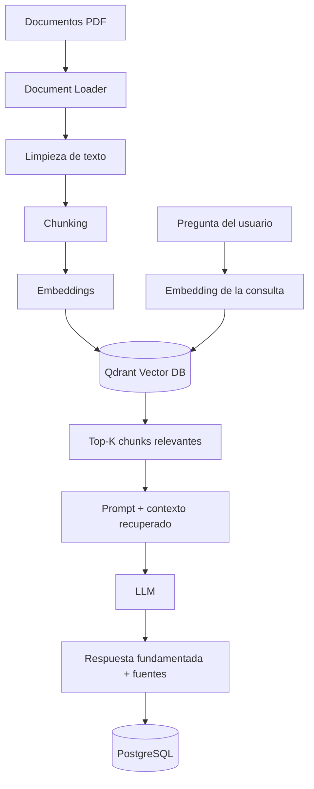
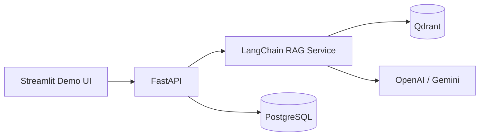

# Enterprise RAG Assistant

> **MVP empresarial de Retrieval-Augmented Generation (RAG) para consultar documentación interna con respuestas fundamentadas, recuperación semántica y trazabilidad de fuentes.**

[🇬🇧 English version](README.md)

## Descripción general

**Enterprise RAG Assistant** es un proyecto de AI Engineering diseñado para transformar documentación interna de una empresa en una base de conocimiento consultable mediante lenguaje natural.

El sistema sigue una arquitectura profesional de **Retrieval-Augmented Generation (RAG)**:

1. Los documentos son cargados y procesados.
2. El texto se divide en fragmentos semánticamente útiles.
3. Los fragmentos se convierten en embeddings vectoriales.
4. Los embeddings se almacenan en una base de datos vectorial.
5. La consulta del usuario se convierte en embedding y se compara con los fragmentos más relevantes.
6. El contexto recuperado se envía a un LLM.
7. El modelo genera una respuesta fundamentada e incluye referencias a las fuentes utilizadas.

El objetivo es demostrar un pipeline RAG de extremo a extremo utilizando tecnologías comúnmente requeridas en posiciones de **AI Engineer, Generative AI y LLM Engineer**.

---

## Problema de negocio

Las empresas suelen almacenar información crítica en manuales de RR.HH., políticas internas, procedimientos técnicos, documentación de seguridad, contratos y guías operativas. Encontrar una respuesta específica de forma manual puede ser lento e ineficiente.

Este proyecto permite realizar preguntas como:

> “¿Cuántos días de vacaciones le corresponden a un trabajador?”

> “¿Cuál es el procedimiento para reportar un correo sospechoso?”

> “¿Quién debe aprobar una solicitud de acceso?”

En lugar de responder únicamente con el conocimiento general del LLM, el sistema recupera primero la información interna relevante y la utiliza como evidencia para generar la respuesta.

---

## Arquitectura



### Arquitectura planificada de la aplicación



---

## Pipeline RAG

### 1. Ingesta de documentos

Los documentos PDF son cargados conservando metadatos como archivo de origen, número de página, título y cantidad total de páginas.

```text
PDF
 ↓
Document Loader
 ↓
Objetos Document de LangChain
```

### 2. Chunking

Los documentos extensos se dividen en fragmentos pequeños con solapamiento.

Configuración actual:

```text
chunk_size    = 800
chunk_overlap = 150
```

El overlap ayuda a conservar el contexto cuando una idea se extiende entre los límites de dos chunks.

```text
Páginas del documento
      ↓
RecursiveCharacterTextSplitter
      ↓
Chunks de texto + metadatos
```

### 3. Embeddings

Cada chunk será transformado en una representación vectorial densa.

```text
Chunk
  ↓
Modelo de embeddings
  ↓
[0.021, -0.113, 0.874, ...]
```

Esto permite comparar textos por **similitud semántica**, no solo por coincidencia exacta de palabras.

### 4. Almacenamiento vectorial

Los embeddings y sus metadatos se almacenarán en **Qdrant**.

Ejemplo de metadatos:

```json
{
  "document": "manual_rrhh_empresa_demo.pdf",
  "page": 4,
  "chunk_id": 12
}
```

### 5. Retrieval

Cuando el usuario realiza una pregunta:

```text
Pregunta
   ↓
Embedding de la consulta
   ↓
Búsqueda por similitud vectorial
   ↓
Top-K chunks relevantes
```

El retriever selecciona la evidencia más relevante de la base de conocimiento.

### 6. Generación

Los chunks recuperados se incorporan al prompt del LLM:

```text
INSTRUCCIÓN DEL SISTEMA
+
CONTEXTO RECUPERADO
+
PREGUNTA DEL USUARIO
↓
LLM
↓
RESPUESTA + FUENTE
```

El modelo será instruido para responder únicamente con base en la evidencia recuperada. Si el contexto es insuficiente, deberá indicar explícitamente que no encontró información confiable para responder.

---

## Stack tecnológico

| Capa | Tecnología | Propósito |
|---|---|---|
| Lenguaje | Python | Lógica principal de la aplicación e IA |
| Framework RAG | LangChain | Orquestación del pipeline RAG e integraciones |
| Procesamiento PDF | PyPDFLoader | Ingesta de documentos PDF |
| División de texto | RecursiveCharacterTextSplitter | Generación de chunks |
| Embeddings | OpenAI / Hugging Face | Representación vectorial semántica |
| Base vectorial | Qdrant | Almacenamiento de vectores y búsqueda por similitud |
| API | FastAPI | Backend REST |
| Base relacional | PostgreSQL | Conversaciones y metadatos de documentos |
| Interfaz demo | Streamlit | Demo ligera del proyecto |
| Contenedores | Docker / Docker Compose | Entorno local reproducible |
| Control de versiones | Git / GitHub | Código fuente e historial del proyecto |

---

## Estado actual del proyecto

| Fase | Descripción | Estado |
|---|---|---|
| 0 | Configuración inicial del proyecto | ✅ Completado |
| 1 | PDF Loader | ✅ Completado |
| 2 | Chunking | ✅ Completado |
| 3 | Embeddings | ⏳ Siguiente |
| 4 | Almacenamiento vectorial con Qdrant | ⏳ Planificado |
| 5 | Recuperación semántica | ⏳ Planificado |
| 6 | RAG + generación con LLM | ⏳ Planificado |
| 7 | FastAPI | ⏳ Planificado |
| 8 | Persistencia con PostgreSQL | ⏳ Planificado |
| 9 | Demo con Streamlit | ⏳ Planificado |
| 10 | Docker | ⏳ Planificado |

### Resultado actual

```text
10 páginas PDF
      ↓
PDF Loader
      ↓
18 chunks de texto
      ↓
Metadatos preservados
```

---

## Estructura del proyecto

```text
enterprise-rag-assistant/
│
├── backend/
│   ├── app/
│   │   ├── api/
│   │   ├── database/
│   │   ├── rag/
│   │   │   ├── loader.py
│   │   │   └── splitter.py
│   │   ├── services/
│   │   └── main.py
│   └── requirements.txt
│
├── data/
│   └── sample_docs/
│       └── manual_rrhh_empresa_demo.pdf
│
├── tests/
├── ui/
│   └── streamlit_app.py
│
├── .env.example
├── .gitignore
├── docker-compose.yml
└── README.md
```

---

## Configuración local

### 1. Clonar el repositorio

```bash
git clone https://github.com/JohanMV/enterprise-rag-assistant.git
cd enterprise-rag-assistant
```

### 2. Crear un entorno virtual

```bash
python -m venv .venv
```

Windows:

```bash
.venv\Scripts\activate
```

### 3. Instalar dependencias

```bash
pip install -r backend/requirements.txt
```

### 4. Ejecutar la prueba actual de ingesta

```bash
python backend/app/rag/loader.py
```

Salida esperada:

```text
Páginas cargadas: 10
Chunks generados: 18
```

---

## Decisiones de diseño

### ¿Por qué RAG en lugar de fine-tuning?

RAG es más adecuado para conocimiento empresarial privado y cambiante porque:

- los documentos pueden actualizarse sin reentrenar el modelo;
- las respuestas pueden citar las fuentes utilizadas;
- la base de conocimiento permanece separada del LLM;
- el costo de implementación es menor;
- la información empresarial puede administrarse de forma independiente.

### ¿Por qué LangChain?

El MVP sigue un flujo principalmente lineal:

```text
Load → Split → Embed → Retrieve → Generate
```

LangChain proporciona las abstracciones necesarias para integrar estos componentes sin introducir complejidad de orquestación innecesaria.

**LangGraph** puede incorporarse posteriormente si el sistema evoluciona hacia flujos agentic con bifurcaciones, reintentos, estado, aprobación humana o múltiples agentes.

### ¿Por qué Qdrant?

Qdrant ofrece indexación vectorial, búsqueda por similitud, filtrado mediante metadatos, almacenamiento persistente y APIs orientadas a entornos productivos.

---

## Estrategia de evaluación

El proyecto no se considerará completo únicamente porque genere una respuesta. El pipeline será evaluado mediante:

### Calidad de retrieval

¿El retriever devuelve chunks que contienen la evidencia correcta?

### Groundedness

¿La respuesta generada está sustentada por el contexto recuperado?

### Trazabilidad de fuentes

¿El sistema puede identificar correctamente el documento y la página de origen?

### Comportamiento sin respuesta

¿El sistema evita inventar información cuando no existe evidencia suficiente?

### Latencia

¿El tiempo de respuesta es adecuado para una aplicación interactiva?

---

## Mejoras planificadas

Después de estabilizar el MVP:

- Hybrid Search
- filtrado por metadatos
- reranking
- proveedores de embeddings configurables
- observabilidad con LangSmith / Langfuse
- evaluación automatizada de RAG
- soporte para DOCX y TXT
- autenticación
- control de acceso por documento
- Agentic RAG basado en LangGraph
- flujos human-in-the-loop

---

## Caso de uso de ejemplo

**Documento:** `manual_rrhh_empresa_demo.pdf`

**Pregunta:**

```text
¿Cuántos días de vacaciones corresponden a un trabajador?
```

Flujo final esperado:

```text
Pregunta del usuario
      ↓
Embedding
      ↓
Búsqueda en Qdrant
      ↓
Chunk relevante de política de RR.HH.
      ↓
LLM
      ↓
Respuesta fundamentada
      ↓
Fuente: manual_rrhh_empresa_demo.pdf — página 5
```

---

## Objetivo de ingeniería

Este repositorio está diseñado intencionalmente como un **proyecto de AI Engineering**, no únicamente como una demo de chatbot.

El objetivo es demostrar conocimiento práctico de:

- Retrieval-Augmented Generation
- pipelines de ingesta de documentos
- estrategias de chunking
- embeddings
- bases de datos vectoriales
- recuperación semántica
- grounding de prompts
- integración con LLMs
- APIs REST
- persistencia
- contenerización
- evaluación de sistemas de IA

---

## Autor

**Johan Moreno**  
Software Engineer · AI · Automation · Cybersecurity  
GitHub: [JohanMV](https://github.com/JohanMV)
