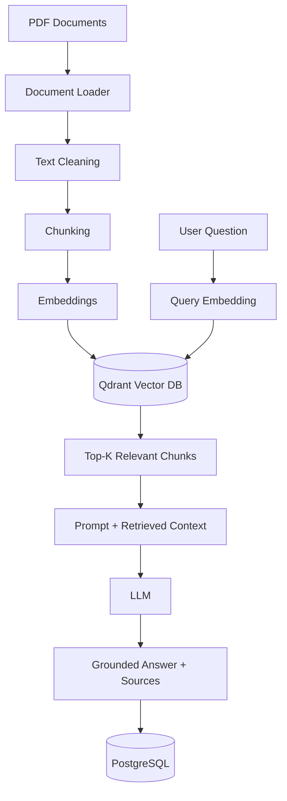
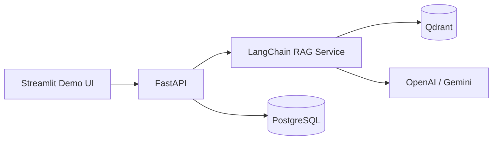

# Enterprise RAG Assistant

> **Enterprise-grade Retrieval-Augmented Generation (RAG) MVP for querying internal business documents with grounded answers, semantic retrieval and source traceability.**

[🇬🇧 Version en Español](README.es.md)


## Overview

**Enterprise RAG Assistant** is an AI Engineering project designed to transform internal business documentation into a searchable knowledge base that can be queried using natural language.

The system follows a professional **Retrieval-Augmented Generation (RAG)** architecture:

1. Documents are ingested and parsed.
2. Text is split into semantically useful chunks.
3. Chunks are converted into vector embeddings.
4. Embeddings are stored in a vector database.
5. A user query is embedded and matched against the most relevant chunks.
6. Retrieved context is passed to an LLM.
7. The model generates a grounded response with source references.

The goal is to demonstrate an end-to-end RAG pipeline using technologies commonly required in **AI Engineer, Generative AI and LLM Engineer** roles.

---

## Business Problem

Companies usually store critical knowledge across HR manuals, internal policies, technical procedures, security documentation, contracts and operational guides. Finding a specific answer manually can be slow and inefficient.

This project allows users to ask questions such as:

> “How many vacation days are employees entitled to?”

> “What is the procedure for reporting a suspicious email?”

> “Who must approve an access request?”

Instead of answering only from the LLM's general knowledge, the system retrieves relevant internal information first and uses it as evidence for the response.

---

## Architecture



### Planned application architecture



---

## RAG Pipeline

### 1. Document ingestion

PDF documents are loaded while preserving metadata such as source file, page number, title and total pages.

```text
PDF
 ↓
Document Loader
 ↓
LangChain Document objects
```

### 2. Chunking

Large documents are divided into smaller overlapping fragments.

Current configuration:

```text
chunk_size    = 800
chunk_overlap = 150
```

The overlap helps preserve context when information crosses chunk boundaries.

```text
Document pages
      ↓
RecursiveCharacterTextSplitter
      ↓
Text chunks + metadata
```

### 3. Embeddings

Each chunk will be transformed into a dense vector representation.

```text
Chunk
  ↓
Embedding Model
  ↓
[0.021, -0.113, 0.874, ...]
```

This allows the system to compare text by **semantic similarity**, not only exact keywords.

### 4. Vector storage

Embeddings and metadata will be stored in **Qdrant**.

Example metadata:

```json
{
  "document": "manual_rrhh_empresa_demo.pdf",
  "page": 4,
  "chunk_id": 12
}
```

### 5. Retrieval

When a user submits a question:

```text
Question
   ↓
Query Embedding
   ↓
Vector Similarity Search
   ↓
Top-K Relevant Chunks
```

The retriever selects the most relevant evidence from the knowledge base.

### 6. Generation

Retrieved chunks are injected into the LLM prompt:

```text
SYSTEM INSTRUCTION
+
RETRIEVED CONTEXT
+
USER QUESTION
↓
LLM
↓
ANSWER + SOURCE
```

The model will be instructed to answer only from retrieved evidence. If context is insufficient, it should explicitly indicate that no reliable answer was found.

---

## Tech Stack

| Layer | Technology | Purpose |
|---|---|---|
| Language | Python | Core application and AI logic |
| RAG framework | LangChain | RAG orchestration and integrations |
| Document parsing | PyPDFLoader | PDF ingestion |
| Text splitting | RecursiveCharacterTextSplitter | Chunk generation |
| Embeddings | OpenAI / Hugging Face | Semantic vector representation |
| Vector database | Qdrant | Vector storage and similarity search |
| API | FastAPI | REST backend |
| Relational database | PostgreSQL | Conversations and document metadata |
| Demo interface | Streamlit | Lightweight project demo |
| Containers | Docker / Docker Compose | Reproducible local environment |
| Version control | Git / GitHub | Source code and project history |

---

## Current Project Status

| Phase | Description | Status |
|---|---|---|
| 0 | Project setup | ✅ Completed |
| 1 | PDF Loader | ✅ Completed |
| 2 | Chunking | ✅ Completed |
| 3 | Embeddings | ⏳ Next |
| 4 | Qdrant vector storage | ⏳ Planned |
| 5 | Semantic retrieval | ⏳ Planned |
| 6 | RAG + LLM generation | ⏳ Planned |
| 7 | FastAPI | ⏳ Planned |
| 8 | PostgreSQL persistence | ⏳ Planned |
| 9 | Streamlit demo | ⏳ Planned |
| 10 | Docker | ⏳ Planned |

### Current result

```text
10 PDF pages
      ↓
PDF Loader
      ↓
18 text chunks
      ↓
Metadata preserved
```

---

## Project Structure

```text
enterprise-rag-assistant/
│
├── backend/
│   ├── app/
│   │   ├── api/
│   │   ├── database/
│   │   ├── rag/
│   │   │   ├── loader.py
│   │   │   └── splitter.py
│   │   ├── services/
│   │   └── main.py
│   └── requirements.txt
│
├── data/
│   └── sample_docs/
│       └── manual_rrhh_empresa_demo.pdf
│
├── tests/
├── ui/
│   └── streamlit_app.py
│
├── .env.example
├── .gitignore
├── docker-compose.yml
└── README.md
```

---

## Local Setup

### 1. Clone the repository

```bash
git clone https://github.com/JohanMV/enterprise-rag-assistant.git
cd enterprise-rag-assistant
```

### 2. Create a virtual environment

```bash
python -m venv .venv
```

Windows:

```bash
.venv\Scripts\activate
```

### 3. Install dependencies

```bash
pip install -r backend/requirements.txt
```

### 4. Run the current ingestion test

```bash
python backend/app/rag/loader.py
```

Expected output:

```text
Páginas cargadas: 10
Chunks generados: 18
```

---

## Design Decisions

### Why RAG instead of fine-tuning?

RAG is better suited for private and frequently changing business knowledge because:

- documents can be updated without retraining the model;
- answers can reference source material;
- the knowledge base remains external to the LLM;
- implementation cost is lower;
- enterprise data can be managed independently.

### Why LangChain?

The MVP follows a mostly linear workflow:

```text
Load → Split → Embed → Retrieve → Generate
```

LangChain provides the abstractions required to integrate these components without introducing unnecessary orchestration complexity.

**LangGraph** may be added later if the system evolves toward agentic workflows with branching, retries, state, human approval or multiple agents.

### Why Qdrant?

Qdrant provides vector indexing, similarity search, metadata filtering, persistent storage and production-oriented APIs.

---

## Evaluation Strategy

The project will not be considered complete only because it produces an answer. The pipeline will be evaluated using:

### Retrieval quality
Does the retriever return chunks containing the correct evidence?

### Groundedness
Is the generated answer supported by retrieved context?

### Source traceability
Can the system identify the source document and page?

### No-answer behavior
Does the system avoid inventing an answer when evidence is missing?

### Latency
Is response time acceptable for an interactive application?

---

## Planned Improvements

After the MVP is stable:

- Hybrid Search
- metadata filtering
- reranking
- configurable embedding providers
- LangSmith / Langfuse observability
- automated RAG evaluation
- support for DOCX and TXT
- authentication
- document-level access control
- LangGraph-based Agentic RAG
- human-in-the-loop workflows

---

## Example Use Case

**Document:** `manual_rrhh_empresa_demo.pdf`

**Question:**

```text
¿Cuántos días de vacaciones corresponden a un trabajador?
```

Expected final flow:

```text
User Question
      ↓
Embedding
      ↓
Qdrant Search
      ↓
Relevant HR Policy Chunk
      ↓
LLM
      ↓
Grounded Answer
      ↓
Source: manual_rrhh_empresa_demo.pdf — page 5
```

---

## Engineering Goal

This repository is intentionally built as an **AI Engineering project**, not only as a chatbot demo.

The objective is to demonstrate practical knowledge of:

- Retrieval-Augmented Generation
- document ingestion pipelines
- chunking strategies
- embeddings
- vector databases
- semantic retrieval
- prompt grounding
- LLM integration
- REST APIs
- persistence
- containerization
- evaluation of AI systems

---

## Author

**Johan Moreno**  
Software Engineer · AI · Automation · Cybersecurity  
GitHub: [JohanMV](https://github.com/JohanMV)
